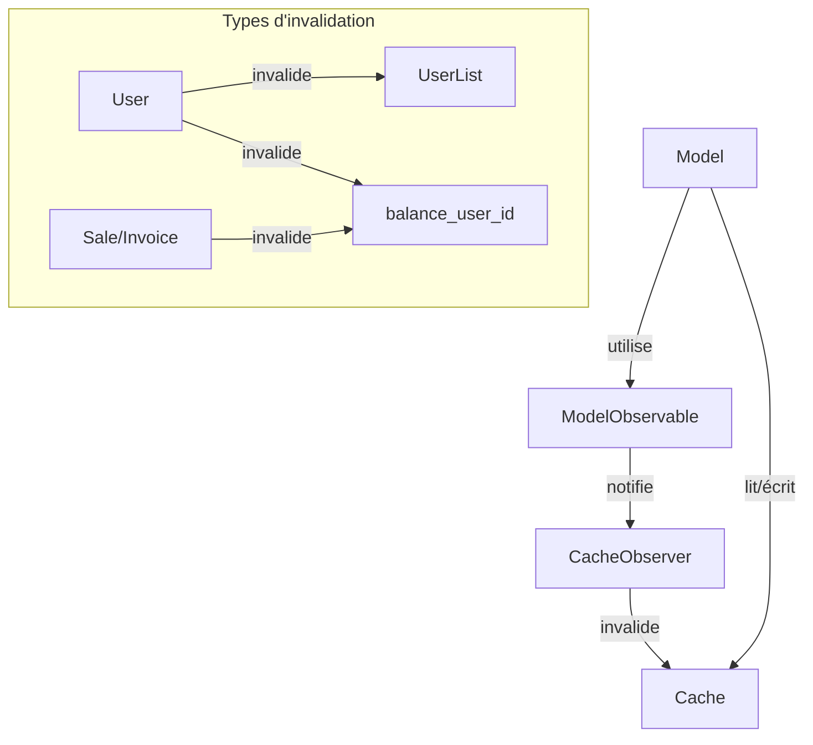

# Système de Cache du CRM

## Architecture Globale



## 1. Composants Principaux

### 1.1 Model (Model.php)
Base de tous les modèles, gère le stockage et la récupération du cache.

```php
// Exemple d'utilisation du cache dans un modèle
class User extends Model {
    // Récupérer tous les utilisateurs (avec cache)
    public function getAllUsers() {
        return $this->getAll(); // Utilise le cache automatiquement
    }
}

// Usage :
$users = new User();
$userList = $users->getAll(); // Récupère depuis le cache si disponible
```

### 1.2 CacheObserver (CacheObserver.php)
Observe les modifications et invalide le cache intelligemment.

```php
// Exemple d'invalidation automatique
$user = new User();
$user->name = "John Doe";
$user->save(); // Déclenche automatiquement :
               // 1. Notification via ModelObservable
               // 2. Invalidation de 'UserList' dans CacheObserver
```

### 1.3 ModelObservable (Trait)
Fait le lien entre les modèles et l'observateur.

```php
// Le trait est déjà inclus dans Model.php
use Traits\ModelObservable;

// Il notifie automatiquement lors des opérations :
$model->save();     // Notifie 'created' ou 'updated'
$model->delete(1);  // Notifie 'deleted'
```

## 2. Clés de Cache Courantes

| Clé | Description | Quand est-elle invalidée ? |
|-----|-------------|---------------------------|
| `UserList` | Liste de tous les utilisateurs | À chaque modification d'utilisateur |
| `balance_user_{id}` | Solde d'un utilisateur | Modification de User/Sale/Invoice |
| `{ModelName}List` | Liste d'objets d'un modèle | À la modification du modèle |

## 3. Exemples Détaillés

### 3.1 Gestion des Utilisateurs
```php
// Scénario : Mise à jour d'un utilisateur
$user = new User();
$user->get(1);
$user->name = "Nouveau Nom";
$user->save();

// Ce qui se passe en coulisse :
// 1. save() appelle notifyObservers('updated')
// 2. CacheObserver::updated() est appelé
// 3. Le cache 'UserList' est invalidé
// 4. Le cache 'balance_user_1' est invalidé
```

### 3.2 Gestion des Ventes
```php
// Scénario : Nouvelle vente
$sale = new Sale();
$sale->userId = 1;
$sale->amount = 100;
$sale->save();

// En coulisse :
// 1. save() appelle notifyObservers('created')
// 2. CacheObserver::created() est appelé
// 3. Le cache 'balance_user_1' est invalidé
// 4. Le solde est recalculé automatiquement
```

## 4. Débogage

### 4.1 Activation des Logs
Dans votre fichier de configuration :
```php
define('LOG_CACHE_OBSERVER', true);
```

### 4.2 Utilisation de la DebugBar
La DebugBar affiche en temps réel :
- Les clés de cache invalidées
- Le timing des opérations de cache
- Les hits/miss du cache

### 4.3 Logs Typiques
```
[DEBUG] Cache observer: {
    'model': 'Models\User',
    'action': 'updated',
    'id': 1,
    'cache_keys_invalidated': [
        'UserList',
        'balance_user_1'
    ]
}
```

## 5. Bonnes Pratiques

1. **Ne pas contourner le système**
   ```php
   // ❌ À éviter
   $cache->set('UserList', $data);
   
   // ✅ Utiliser les méthodes du modèle
   $user->updateAll($data);
   ```

2. **Vérifier les invalidations**
   - Utiliser la DebugBar en développement
   - Activer LOG_CACHE_OBSERVER en cas de problème

3. **Gérer les dépendances**
   - Penser aux caches liés (ex: solde utilisateur)
   - Documenter les nouvelles clés de cache

## 6. Résolution des Problèmes Courants

1. **Cache non invalidé**
   - Vérifier que le modèle utilise ModelObservable
   - Vérifier les logs du CacheObserver

2. **Performances**
   - Éviter les invalidations en cascade
   - Utiliser des clés de cache spécifiques

3. **Données incohérentes**
   - Vérifier les clés dans getCacheKeysToInvalidate()
   - S'assurer que tous les chemins de modification passent par save()
